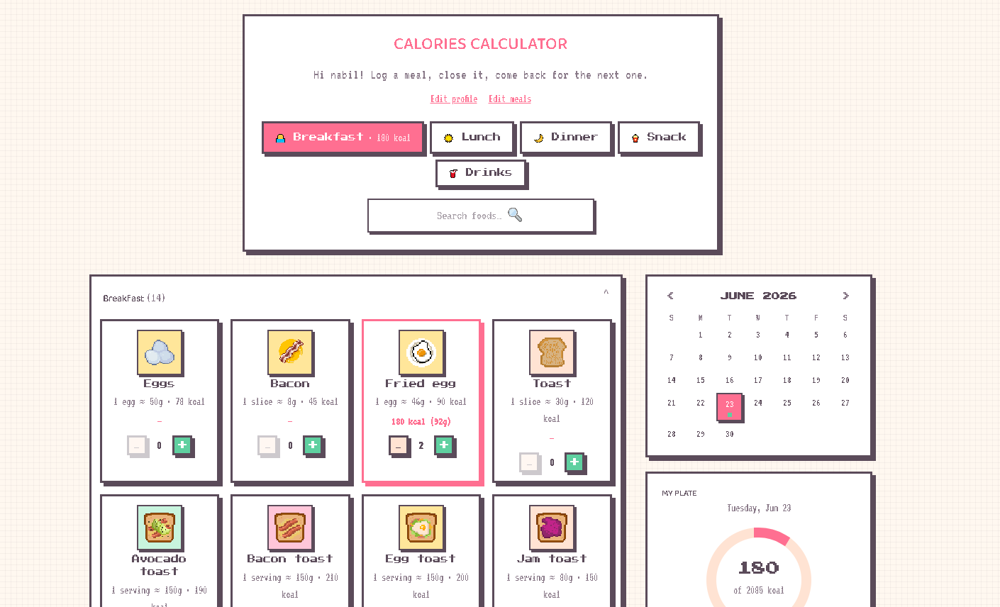
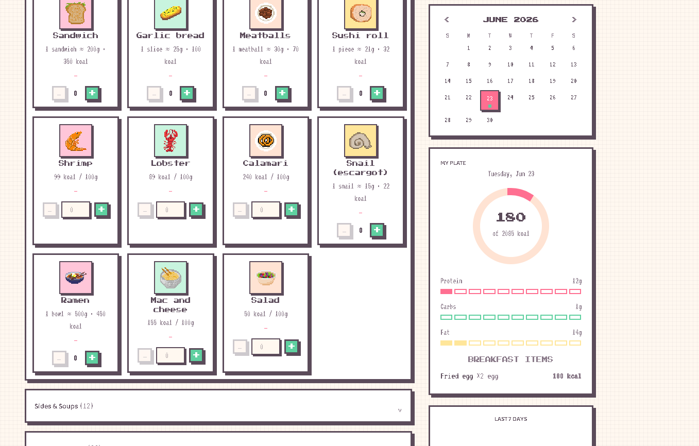

# Calories Calculator

A retro-styled calorie tracker built with React, TypeScript, Vite, and Tailwind CSS.

Live demo:
[https://benkixx.github.io/Calories-calculator/](https://benkixx.github.io/Calories-calculator/)

## Overview

Calories Calculator helps you log meals quickly, track calories and macros, and review your day in a simple pixel-art interface.

## Screenshots





## Features

- Profile-based calorie and macro targets
- Meal tabs for breakfast, lunch, dinner, snacks, and drinks
- Searchable food library with visual cards
- Daily calendar with intake overview
- Macro progress and calorie ring
- 7-day summary panel
- Data saved locally in the browser

## Tech Stack

- React 19
- TypeScript
- Vite
- Tailwind CSS v4
- GitHub Pages for deployment

## Getting Started

### Install

```bash
npm install
```

### Start the app

```bash
npm run dev
```

### Build for production

```bash
npm run build
```

### Preview the production build

```bash
npm run preview
```

## Project Structure

```text
src/
  assets/        Food icons
  components/    UI building blocks
  data/          Food dataset
  lib/           Nutrition, storage, and totals logic
```

## Deployment

The project is configured to deploy automatically to GitHub Pages from the `main` branch with GitHub Actions.

## License

This project is available under the [MIT License](./LICENSE).
