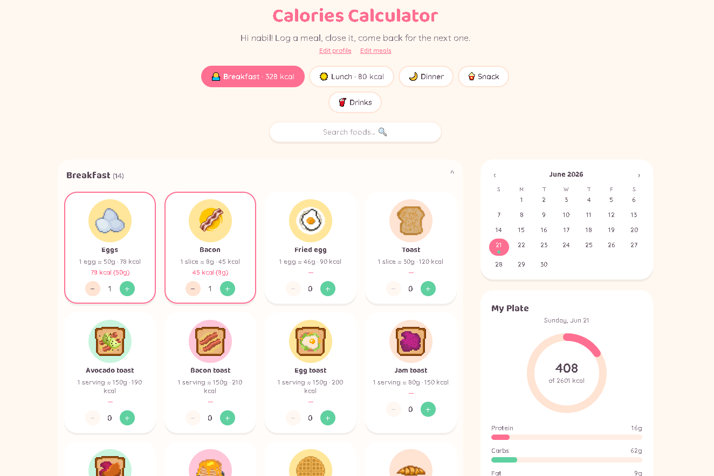

# Calories Calculator 🍽️

A cute, pixel-art calorie and meal tracker. Pick foods, log them under the
right meal, and see your day add up against a target calculated from your
own body stats — all stored locally in your browser.



## Features

- **89 foods** across 6 categories (Breakfast, Mains, Sides & Soups, Snacks
  & Sweets, Drinks, Condiments), each with a pixel-art icon and real
  nutrition data.
- **Grams or pieces** — weigh-able foods (rice, meat, soups...) take a free
  gram amount, countable foods (eggs, slices, cans...) use a simple +/-
  stepper with the gram equivalent shown.
- **Personal calorie target** — enter your age, sex, height, weight,
  activity level and goal (lose / maintain / gain), and the app works out
  your BMR/TDEE and a daily calorie + macro target (Mifflin-St Jeor
  formula).
- **Configurable meals** — choose how many meals you eat a day and what
  each one is (Breakfast, Lunch, Dinner, Snack, Drinks). Log one meal, come
  back later for the next one — nothing is lost.
- **Calendar history** — every day is saved on its own; browse past days
  and see a coloured dot for whether you were under, on, or over target.
- **Analytics** — a 7-day calorie trend and a short note on how today is
  tracking against your goal.

Everything is saved to `localStorage` — no account, no server, no syncing
between devices.

## Running it

```bash
npm install
npm run dev
```

Or, on Windows, just double-click `run.bat`.

## Tech stack

React + TypeScript + Tailwind CSS, built with Vite.

## License

MIT — see [LICENSE](LICENSE).
